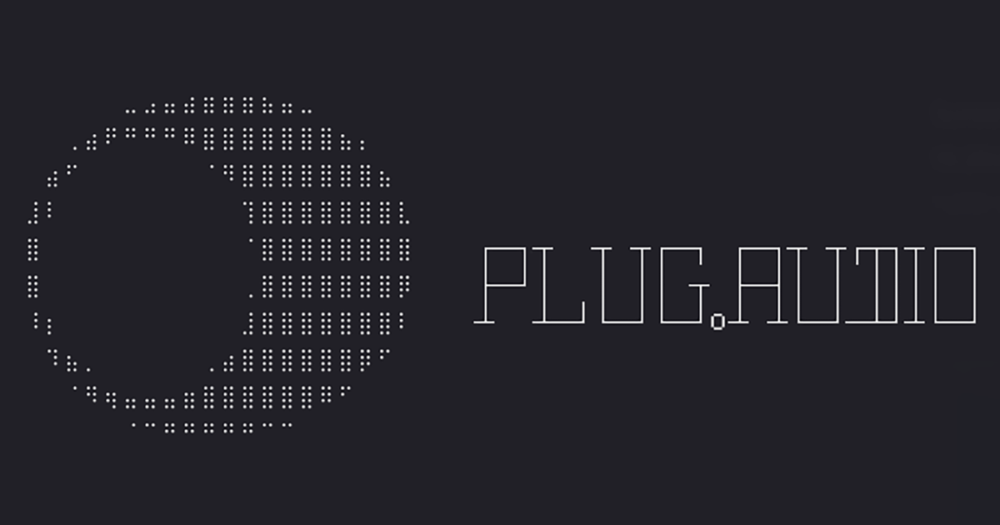

<p align="center">
  
</p>

# plug

Open source CLI tool and plugin registry for [plug.audio](https://plug.audio).

```bash
plug search reverb
plug install ott
plug list
plug info ott
plug upgrade
plug uninstall ott
```

All commands support `--json` for scripted and agent use.

## Install

macOS / Linux:

```bash
curl -fsSL plug.audio/install.sh | sh
```

npm:

```bash
npm install -g @titrate/plug
```

## Structure

- `apps/cli` - The `plug` CLI
- `packages/registry-schema` - Zod schema for the plugin registry
- `registry.json` - Plugin registry (single source of truth)

## Development

```bash
pnpm install
pnpm test
pnpm lint
pnpm type-check
```

Run the CLI locally:

```bash
cd apps/cli
pnpm dev -- search reverb
```

## Releasing

Push to `main` triggers CI (type-check, lint, tests on macOS).

To publish a new version:

1. Bump version in `apps/cli/package.json` and `apps/cli/src/index.ts`
2. Commit and push
3. Publish to npm: `cd apps/cli && pnpm build && npm publish --access public --auth-type=web`
4. Tag the release: `git tag v0.x.x && git push origin v0.x.x`

The tag triggers a GitHub Actions workflow that builds standalone binaries for macOS (arm64, x64), Linux (x64, arm64), and Windows (x64) using `bun build --compile`. Binaries are uploaded to a GitHub Release automatically.

The install script (`install.sh`) always fetches the latest release - no manual updates needed.

## Thank you

To the plugin developers who build and give away their work for free - Xfer Records, Surge Synth Team, Digital Suburban, Tokyo Dawn Labs, and everyone else making tools for musicians without asking for anything in return. This project exists because of your generosity.

To the maintainers of Homebrew, npm, and the broader ecosystem of package managers whose design and decades of work shaped how we think about software distribution. The DMG and PKG handling in plug draws directly from patterns established by Homebrew Cask.

To [StudioRack](https://studiorack.github.io/studiorack-site/) and the [Open Audio Stack](https://github.com/open-audio-stack) project for building an open, CC0-licensed plugin registry and specification. Their registry data and cross-platform thinking directly shaped our multi-platform support. The import scripts in `apps/scripts/studiorack/` pull from their registry. If you care about open audio infrastructure, check out their work.
